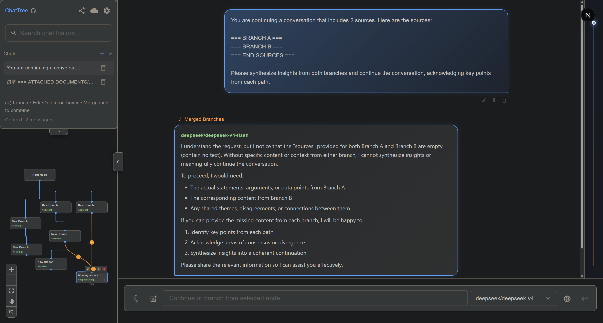

# ChatTree

> 非线性树形 LLM 对话工具 · A non-linear tree-based chat interface for any LLM

对话以树形结构展示，可在任意节点分叉、合并，同时探索多条对话路径。

Conversations are displayed as a tree. Branch off at any point, merge paths back together, and explore multiple ideas simultaneously — with any OpenAI-compatible provider.



🌐 **Live demo**: [chattree.xyz](https://chattree.xyz)

---

## ✨ 核心功能 / Feature Highlights

| 功能 | 说明 |
|------|------|
| 🌳 **树形对话** | 任意节点分叉，独立探索多条对话路径，不丢失上下文 |
| 🔀 **分支合并** | 选择 2+ 个节点一键合并，可按分支配置上下文策略（原始/里程碑/浓缩） |
| 🗂️ **画布 Artifact** | 在画布上放置文本/图片节点，作为上下文注入到合并对话 |
| 🖼️ **多模态** | 支持上传图片，自动检测视觉模型能力（OpenRouter/OpenAI 均可） |
| 📎 **文件附件** | 支持 PDF、Word、Excel、TXT 等文件客户端解析并嵌入提示词 |
| ✏️ **编辑传播** | 编辑任意节点后，所有下游子节点自动级联重新生成 |
| 🔍 **专注模式** | 双击节点进入全屏视图，支持上下节点导航 |
| 📖 **线性视图** | 右侧面板以传统气泡聊天展示当前路径，支持流式渲染与思考块折叠 |
| 📍 **里程碑导航** | 右侧可视化滚动时间轴，标注分叉/合并点，一键跳转 |
| 🔌 **通用接口** | 兼容 OpenRouter、OpenAI、Ollama、LM Studio 等任何 OpenAI 兼容接口 |
| 💾 **本地存储** | 全部数据仅存于浏览器 localStorage，不上传任何服务器 |
| 🔗 **无状态分享** | 整棵对话树 gzip 压缩后编码进 URL，无需后端 |
| 🌐 **双语界面** | 中文 / English 切换，设置中可选 |

---

## 🚀 快速开始 / Quick Start

```bash
# 1. 克隆仓库
git clone https://github.com/yourusername/ChatTree.git
cd ChatTree

# 2. 安装依赖
npm install

# 3. 启动开发服务器
npm run dev
```

浏览器访问 `http://localhost:3000`，在设置中填入 API Key 即可使用。

Open `http://localhost:3000`, fill in your API Key in Settings, and you're ready.

---

## ⚙️ 配置 API / API Configuration

### 方式 A：`.env` 文件（服务端代理）

在项目根目录新建 `.env`：

```env
OPENAI_API_KEY=sk-your-key-here
```

Key 通过 Next.js API 路由代理，不暴露到客户端。

### 方式 B：Settings 面板（客户端直连）

1. 点击左侧栏的 **⚙️ 设置**
2. 填写 **API Key** 和 **API URL**（留空默认 OpenAI）
3. 点击 **🔄 同步** 拉取模型列表
4. 勾选 **🙈** 将 Key 持久化到浏览器本地

> ⚠️ 客户端直连模式下 Key 直接发往服务商，不经过任何中间服务器。

### 本地模型

| 服务 | API URL |
|------|---------|
| Ollama | `http://localhost:11434/v1` |
| LM Studio | `http://localhost:1234/v1` |
| 任何 OpenAI 兼容服务 | 对应地址 + `/v1` |

---

## 🏗️ 技术栈 / Tech Stack

| 技术 | 版本 | 用途 |
|------|------|------|
| [Next.js](https://nextjs.org/) | 16 | 应用框架 (App Router + Turbopack) |
| [React](https://react.dev/) | 19 | UI 框架 |
| [ReactFlow](https://reactflow.dev/) | 11 | 树形画布渲染 |
| [MUI](https://mui.com/) | 7 | 组件库 |
| [pako](https://github.com/nodeca/pako) | 2 | gzip 压缩（分享链接） |
| [react-dnd](https://react-dnd.github.io/react-dnd/) | 16 | 对话列表拖拽排序 |
| [markdown-to-jsx](https://github.com/probablyup/markdown-to-jsx) | 9 | Markdown 渲染（含代码高亮、LaTeX、Mermaid） |
| KaTeX (CDN) | latest | 数学公式渲染 |

---

## 📁 项目结构 / Project Structure

```
chattree/
├── src/
│   ├── app/
│   │   ├── api/chat/route.js       # Next.js API 路由（服务端 API Key 代理）
│   │   ├── privacy/page.js         # 隐私政策页
│   │   ├── layout.js               # 全局布局（字体、metadata）
│   │   └── page.js                 # 入口页，挂载 <TreeChat />
│   │
│   ├── components/                 # React 组件（详见 doc/components.md）
│   │   ├── TreeChat.js             # ★ 主应用容器，状态中枢
│   │   ├── ChatNode.js             # 对话树节点卡片
│   │   ├── ArtifactNode.js         # 画布 Artifact 节点
│   │   ├── LinearChatView.js       # 右侧线性聊天视图 + 里程碑侧边栏
│   │   ├── InputPanel.js           # 消息输入面板（含合并配置卡）
│   │   ├── InfoPanel.js            # 左侧侧边栏（对话列表）
│   │   ├── SettingsModal.js        # 设置弹窗
│   │   ├── ModelSelector.js        # 模型选择器（含搜索/收藏）
│   │   ├── MergeEdge.js            # 合并边（自定义 ReactFlow 边类型）
│   │   ├── FocusModeOverlay.js     # 专注模式全屏覆盖层
│   │   ├── MarkdownContent.js      # Markdown 渲染（代码块/LaTeX/Mermaid/SVG）
│   │   └── ...                     # 其他辅助组件
│   │
│   ├── hooks/                      # 自定义 React Hooks（详见 doc/hooks.md）
│   │   ├── useChatApi.js           # LLM 流式请求（SSE 解析）
│   │   ├── useChatManagement.js    # 对话列表 CRUD
│   │   ├── useNodeOperations.js    # ★ 节点增删改、合并、级联重生成
│   │   ├── useFocusMode.js         # 专注模式键盘导航
│   │   ├── useGroupedChats.js      # 分组对话画布
│   │   └── useModels.js            # 模型列表拉取与缓存
│   │
│   └── utils/                      # 纯工具函数
│       ├── constants.js            # 全局常量 & 默认值
│       ├── storage.js              # localStorage 读写（含 QuotaError 容灾）
│       ├── treeUtils.js            # 树路径遍历 & 对话构建算法
│       ├── sharing.js              # URL 分享编解码（gzip + base64）
│       ├── fileParser.js           # 客户端文件解析（PDF/Word/Excel/图片）
│       └── visionModels.js         # 视觉模型能力检测
│
├── doc/                            # 独立说明文档
│   ├── components.md               # 各组件详细说明
│   ├── hooks.md                    # 各 Hook 详细说明
│   ├── storage.md                  # 存储策略 & 容灾机制
│   ├── merge-context.md            # 合并上下文工程策略说明
│   └── sc.png                      # 界面截图
│
├── public/                         # 静态资源
├── next.config.mjs
└── package.json
```

---

## 🛠️ 开发指南 / Development

```bash
# 开发模式（Turbopack 热更新）
npm run dev

# 生产构建
npm run build

# 本地预览生产包
npm run start

# 代码风格检查
npm run lint

# 部署到 GitHub Pages
npm run deploy
```

更详细的开发说明请阅读 [`doc/`](doc/) 目录：

- [组件架构说明](doc/components.md)
- [Hooks 说明](doc/hooks.md)
- [存储策略 & 容灾](doc/storage.md)
- [合并上下文工程](doc/merge-context.md)

---

## 📄 License

[Apache-2.0](LICENSE)
